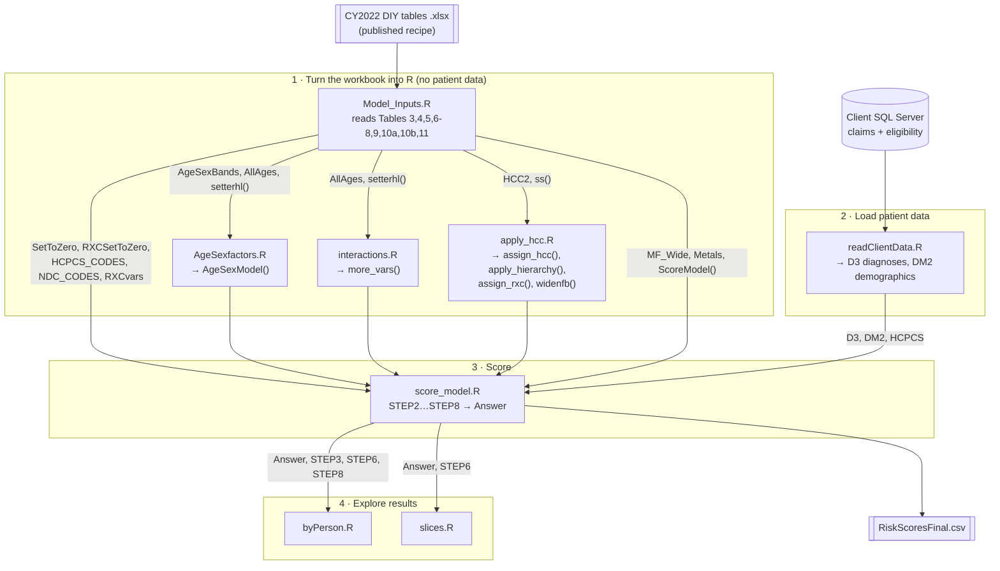
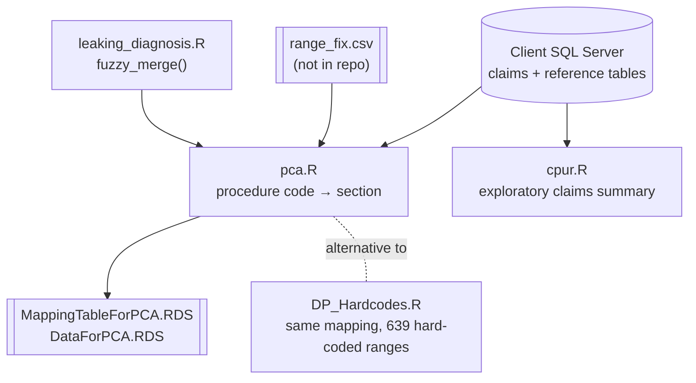

# HCCR: a health risk score engine in R

> **Project status: reference implementation / portfolio example.**
> Starting with benefit year 2026, CMS publishes its own official Python
> software for the HHS-HCC model (replacing the older SAS software), along
> with the yearly DIY tables workbook. For production scoring, use CMS's
> software: it is the authoritative implementation. HCCR remains here as a
> worked example of what can be built in R: compiling a published workbook
> into scoring code, a config-driven design that accepts any model year, and
> a synthetic-data test harness. It is not maintained to track CMS releases,
> and the work needed to do so (new tables such as 10c/10d and 13, database
> wiring for a real client) is deliberately out of scope. A natural use for
> it is as an independent cross-check: score the same patients here and in
> CMS's software and compare. See [Project status](#project-status).

## What problem this solves

Health insurers and the organizations that share financial risk with them
need a fair way to compare groups of patients. A plan whose members are
mostly young and healthy will spend far less than a plan full of people with
diabetes, heart failure, or cancer, even if both plans are equally well run.
**Risk adjustment** corrects for that: every patient gets a number, a
*risk score*, that says how expensive their care is expected to be compared
with an average person. A score of 1.0 is average; 2.5 means roughly two and a
half times the expected cost. Payments between plans, or bonuses for
organizations that manage care well, are then adjusted by those scores.

The US federal government (the Department of Health and Human Services, HHS,
through its agency CMS) publishes the official recipe for one of these scores,
the **HHS-HCC model**. HCC stands for *Hierarchical Condition Category*: it
turns thousands of individual diagnosis codes into more than 100 condition groups
("Diabetes with chronic complications", "Heart failure", ...), each with a
price tag. The recipe is published every year as an Excel workbook, the
"DIY (Do It Yourself) tables". When this project was written, the official
reference implementation was in SAS, a commercial statistics language; CMS
now publishes Python software instead (see the status note above).

**HCCR re-implements that recipe in R.** Rather than hand-typing hundreds of
rules and coefficients each year, it reads the published workbook and
*generates* the R code that applies the rules. When a new year's workbook
comes out, the idea is to point HCCR at the new file instead of rewriting
the program.

## How a risk score is built (the recipe in plain terms)

For each patient, over one year of insurance claims:

1. **Who are they?** Age and sex put the patient into a demographic band
   (for example "female, 45 to 49"). Adults, children, and infants are scored
   by separate models.
2. **How long were they covered?** Adults covered for only part of the year get
   an enrollment-duration adjustment (`ED_1` ... `ED_11`).
3. **What conditions do they have?** Every diagnosis code on their claims
   (ICD-10 codes, such as `E11.9` for type 2 diabetes) is mapped to a condition
   category (HCC). Some mappings only apply at certain ages or to one sex.
4. **Keep only the most serious version.** Categories form hierarchies: if a
   patient has "metastatic cancer" they are not also scored for "breast
   cancer". The lesser category is set to zero.
5. **Add combination flags.** Extra variables capture things like "severely
   ill and has this condition" or "has N payment conditions", written in the
   workbook as small `if ... then ...` rules in SAS syntax.
6. **Add up the price tags.** Each variable that is switched on has a
   coefficient. The coefficients differ by plan generosity, named by metal
   tier (Platinum, Gold, Silver, Bronze, Catastrophic). The sum is the
   patient's risk score for that tier.

## What's in the input workbook

`CY2022 DIY tables 06.30.2022.xlsx` (the 2022 benefit year) has these tabs.
HCCR currently reads the ones marked **used**.

| Tab | Contents | Used? |
|---|---|---|
| Table 1 | Which model (Adult, Child, Infant) applies at which age | no (hard-coded) |
| Table 2 | Procedure codes that make a claim eligible | no |
| Table 3 | Diagnosis code → condition category crosswalk, with age/sex conditions | **used** |
| Table 4 | Hierarchies: which categories to zero out when a more serious one is present | **used** |
| Table 5 | Age/sex band definitions | **used** |
| Tables 6, 7, 8 | Extra variables for Adult, Child, Infant models, written as SAS `if/then` rules | **used** |
| Table 9 | Coefficients for every variable, by metal tier | **used** |
| Table 10a / 10b | Prescription drug → drug category crosswalks (NDC and HCPCS codes) | **used** (10a needs pharmacy claims, see Known gaps) |
| Table 11 | Drug-category hierarchies | **used** |
| Table 12 | Conditions excluded from each model | no |

## Configuration

The things that change from year to year, client to client, or
deployment to deployment live in `config.yaml`, loaded by `config.R`
(sourced automatically by `Model_Inputs.R`):

- `model.year` and `model.workbook.path` - which benefit year and which
  workbook file to read.
- `model.workbook.sheets` / `model.workbook.header_skip` - the tab name
  and header-row offset for each table HCCR reads, in case a future
  workbook renames or reshuffles one.
- `model.metal_tiers` - the plan tiers Table 9 publishes a coefficient
  column for.
- `output.risk_scores_csv` - where `score_model.R` writes its output.
- `database.*` - the SQL Server address, database name, table names,
  column names, and claims lookback window `readClientData.R` queries.
  This section only centralizes what was previously hard-coded in that
  file; it doesn't add new database functionality (see Known gaps).

To point the pipeline at a different config file without editing
`config.yaml` in place, set `options(hccr.config_path = 'config-2023.yaml')`
before sourcing `Model_Inputs.R`.

## Updating to a new model year

CMS publishes a new "DIY tables" workbook (and a matching "DIY
instructions" PDF) for each benefit year on cms.gov, usually under
`cms.gov/files/document/cy<YYYY>-diy-...`, sometimes with a mid-year
corrected re-release (the file names carry a revision date, so a given
year may have more than one, e.g. `CY2022 DIY tables 06.30.2022.xlsx`
alongside a later-corrected version). There is no fixed URL pattern
reliable enough to script a download from year to year, so this stays a
manual step:

1. Download the new year's `CY<YYYY> DIY tables ....xlsx` workbook from
   CMS and put it in the repo (or anywhere on disk).
2. In `config.yaml`, set `model.year` to the new year and
   `model.workbook.path` to the new file's path.
3. Open the new workbook and check it against `model.workbook.sheets`
   and `model.workbook.header_skip`. CMS has kept the table numbering
   (Table 1 - Table 12, tab names literally "Table 3", "Table 9", etc.)
   and the header-row offsets stable across the years checked while
   building this, but a workbook is a hand-maintained document - if a
   table reads back empty or misaligned, this is the first place to
   look.
4. Watch for a table CMS has added for that year. CY2025, for example,
   added **Table 13 (CSR Indicators)**; HCCR reads it when
   `csr_indicators` is listed under `sheets:` in the config (see `csr.R`).
   A new model year may add a similarly new table that needs the same
   treatment, or at least a look.
5. Note the model *version* (CMS's HCC classification version, e.g.
   V05/V07/V08) printed in the DIY instructions for that year. HCCR
   doesn't need to know the version number itself - it just reads
   whatever is in the tables - but a version change is usually where
   HCC definitions, not just coefficients, change, so it's worth reading
   that year's instructions PDF for anything structurally different.
6. Re-run `Rscript tests/run_synthetic.R` to confirm the new workbook
   loads and scores the synthetic patients without error before pointing
   the pipeline at real client data.

One more thing worth flagging for future years: CMS's CY2026 DIY
instructions announce that the **reference software is being phased
from SAS to Python**. That's the software CMS itself publishes
alongside the tables, not HCCR, but it's a sign the tables' format or
publication process could change more than usual around that year - the
steps above (especially #3 and #4) are exactly what would need
rechecking.

## How the code is organised

There are two groups of scripts. The **risk score pipeline** is the purpose of
the repo. The **procedure code clustering** scripts are a separate analysis
of doctors' billing patterns from the same client project and do not feed the
risk score.





### Run order for the risk score

The scripts share one R session and pass results through global variables,
so order matters. `Model_Inputs.R` begins with `rm(list=ls())`, which wipes
the session, so it must run first.

```r
source("Model_Inputs.R")    # read the workbook
source("AgeSexfactors.R")   # build AgeSexModel()
source("interactions.R")    # build more_vars()
source("apply_hcc.R")       # build assign_hcc(), apply_hierarchy(), assign_rxc(), widenfb()
source("readClientData.R")  # pull patients from SQL Server
source("score_model.R")     # compute scores → Answer
```

To try it without the database, `Rscript tests/run_synthetic.R` runs the same
steps on six made-up patients (`tests/synthetic_data.R`) chosen to exercise the
hierarchies, the age and sex filters, and the drug variables.

## File guide

### Risk score pipeline

| File | Reads | Produces | What it does |
|---|---|---|---|
| `config.yaml` | - | - | Model year, workbook path/sheet names/header-row offsets, metal tiers, output path, and database server/table/column names. See "Configuration" above. |
| `config.R` | `config.yaml` | `CONFIG`, `hccr_*()` helper functions | Loads the config file once; sourced automatically by `Model_Inputs.R` (and `readClientData.R`). |
| `Model_Inputs.R` | Calls the readers below, via `config.yaml` | `HCC2` (diagnosis → HCC), `SetToZero` (hierarchies), `AgeSexBands`, `AllAges` (if/then rules), `ModelFactors` / `MF_Wide` (coefficients), `Metals`, `NDC_CODES`, `HCPCS_CODES`, `RXCSetToZero` | A short script: one line per workbook table, each calling a reader function. Start here to see what gets loaded. |
| `workbook_readers.R` | Tables 4, 5, 6-8, 9, 10a, 10b, 11 | `read_hierarchies()`, `read_age_sex_bands()`, `read_all_variable_rules()`, `read_model_factors()`, `rxc_crosswalk()`, `read_rxc_hierarchies()`; helpers `ss()`, `dash()`, `rxc_name()`, `setterhl()`, `ScoreModel()` | One small function per table, each taking the workbook path. `setterhl()` is the core trick: it takes a table of R statements stored as text and turns them into one callable R function. |
| `AgeSexfactors.R` | `AgeSexBands`, `AllAges`, `setterhl()` | `AgeSexModel()` | Turns each age/sex band (e.g. `FAGE_LAST_45_49`) into a rule like `pat_gender=='F' & pat_age>=45 & pat_age<=49`, adds the enrollment-duration rule, and compiles them into `AgeSexModel()`. Also builds SQL `CASE WHEN` text (`sql1`, `sql2`) that is not used yet. |
| `interactions.R` | `AllAges`, `setterhl()` | `more_vars()` | Translates the SAS `if … then do; …; end;` rules from Tables 6 to 8 into R `data.table` assignments and compiles one function per model (Adult, Child, Infant); `more_vars()` applies each patient's own model. Also compiles `HCC_CNT = SUM(HHS_HCC*, G*)` count definitions (new in CY2025) and runs the rules that test it after the group zeroing. This is the "SAS to R compiler". |
| `apply_hcc.R` | `HCC2`, `ss()` | `assign_hcc()`, `apply_hierarchy()`, `assign_rxc()`, `widenfb()`, `HCCvars` | `assign_hcc()` joins a patient's diagnoses to condition categories and drops those that fail the age or sex conditions and splits. `apply_hierarchy()` drops the milder categories (Tables 4 and 11). `assign_rxc()` maps drug codes to drug categories. `widenfb()` pivots to one row per patient with one 0/1 column per category, guaranteeing every category column exists. |
| `readClientData.R` | SQL Server database/tables named in `config.yaml`'s `database:` section (defaults to `ModelDevelopment`: `eligibility`, `claims_20210601_to_20220531`) | `D3` (patient × diagnosis), `DM2` (patient age, sex, months enrolled), `HCPCS` (patient × drug/procedure code) | Pulls one benefit year of claims and enrollment for the client, over the window in `config.yaml`'s `database.period`. |
| `score_model.R` | Everything above | `STEP2` … `STEP8`, `Answer`; writes `RiskScoresFinal.csv` | Runs the pipeline: age/sex bands → HCC assignment → hierarchies → drug categories → wide table → combination flags → long table → join coefficients → sum per patient per metal tier. `STEP7` shows each patient's score broken down by variable. |
| `byPerson.R` | `STEP3`, `STEP8`, `Answer`, `HCCvars` | A histogram and summary of Silver scores | Quick look at the distribution of results. |
| `slices.R` | `Answer`, `STEP6`, `ModelFactors`, `HCC_HELPER` | `slicer()`, `j()` | Pulls the patients in a score range and lists the conditions driving their scores. `HCC_HELPER` is not defined anywhere in the repo. |

### Supporting files (not part of the pipeline)

| File | Status |
|---|---|
| `csr.R` | Table 13 | `read_csr_table()`, `csr_by_indicator()`, `apply_csr()` | Cost-sharing adjustment (CY2025+): reads the CSR indicator -> metal tier and factor mapping and adds `CSR_INDICATOR` and `CSR_ADJUSTED_<tier>` columns to the output. |
| `table3_reader.R` | Table 3 of the workbook | `read_icd10_crosswalk()` | Reads the ICD-10 crosswalk by matching column headers, not positions, because CMS changed the layout between years (13 columns in CY2022, 17 in CY2025). Stops with a message naming the missing column if a needed one is absent. |
| `tests/` | `synthetic_data.R` stands in for `readClientData.R` with six made-up patients; `run_synthetic.R` runs the pipeline on them; `run_cy2025.R` and `config-cy2025.yaml` do the same against the CY2025 workbook (download it from CMS; it is not stored in the repo). `generate_synthetic.R` builds a larger made-up population (diagnoses sampled from Table 3; pharmacy fill histories sampled from Table 10a, plus everyday drugs the risk model ignores, such as statins and blood pressure drugs, using real NDC codes in `tests/data/background_ndcs.csv`, built from the FDA NDC Directory by `tests/data/build_background_ndcs.py`) and `run_broad.R` scores it and checks the assigned categories against an independently computed expectation: `Rscript tests/run_broad.R [patients] [seed]`. `run_csr.R` (CY2025) checks the cost-sharing adjustment against the multipliers in Tables 6-8. |
| `sample.dat` | A few lines copied from Tables 6 and 7, showing the SAS rule syntax. |
| `ClaimsAS.RData` | Saved R workspace (about 5 MB unpacked), presumably sample claims or age/sex data; no script loads it. |

### Procedure code clustering (separate analysis)

| File | Reads | Produces | What it does |
|---|---|---|---|
| `leaking_diagnosis.R` | Tables passed in | `leaking()`, `fuzzy_merge()` | Helpers. `fuzzy_merge()` matches a code to the range it falls in and is needed by `pca.R`. The last line runs a debug call on data that must already exist. |
| `pca.R` | SQL Server claims, `ReferenceData.proc_cd_section`, `ReferenceData.ICD`, `range_fix.csv` | `DPS` (claims with a procedure section), `PR`; writes `MappingTableForPCA.RDS`, `DataForPCA.RDS` | Groups each billed procedure code into a named section (for example "Hearing Aids") so providers can be compared by what they bill. |
| `DP_Hardcodes.R` | `DP` | `DP` with `section`, `proc_grp` | The same grouping as `pca.R`, written as 639 hard-coded range assignments. |
| `cpur.R` | SQL Server claims and `ReferenceData.ICD` | Cost summaries by procedure and place of service | Exploratory analysis of primary care usage. |

## Project status

- **Why this exists.** HCCR was built against the CY2022 workbook, when the
  only official implementation was SAS. It re-implements the recipe in R and
  was then generalized (see "Configuration") to accept any model year.
- **Why it is not needed for production.** CMS's Python software, published
  from benefit year 2026, supersedes the SAS reference and is the
  authoritative implementation. I have not audited it against HCCR; any
  claim that the two agree for a given year needs to be checked with the
  test harness below.
- **What was deliberately left undone.** Reading Tables 10c/10d (Affiliated
  Cost Factors), pulling pharmacy claims, and verifying `readClientData.R`
  against a real client database. See "Known gaps".
- **Still useful for.** Learning how the model works, demonstrating the
  workbook-to-code approach, and cross-checking CMS's software on shared
  test patients (`tests/run_synthetic.R`).

## Known gaps

These are what a reader would trip over when running the pipeline today:

- **Validation status.** The pipeline runs on the CY2022 and CY2025
  workbooks. It is tested on a small hand-built data set
  (`tests/run_synthetic.R`; `tests/run_cy2025.R` for CY2025, which also
  checks the HCC count and enrollment-duration variables CY2025 adds) and
  on a generated population of 2,000 patients (`tests/run_broad.R`), which
  checks category assignment and hierarchies but not the scores
  themselves. CY2022 scores are unchanged by the CY2025 work. Neither
  year's scores have been compared with CMS's official software, and no
  other model year has been run.
- **Infant scoring is inferred from the workbook, not checked against CMS.**
  Female infants have no age/sex factor in Table 5 and score from the infant
  maturity-by-severity variable alone; male infants with no newborn HCC are
  moved to `AGE1_MALE` as Table 1/8 describe. Both follow the workbook's
  rules as read here and have not been compared with CMS's software.
- **Database config is centralized but not re-verified.** `readClientData.R`
  now reads its server address, database/table/column names, and claims
  lookback window from `config.yaml` instead of having them hard-coded, but
  the values there are still this one client's: a new client's database
  needs someone to confirm table and column names actually match
  `config.yaml`'s `database:` section before running it (see the project
  to-do list).
- **Pharmacy claims.** Drug categories come from HCPCS codes on medical
  claims. Table 10a (pharmacy NDC codes) is loaded as `NDC_CODES` and
  `assign_rxc(NDC_CODES)` will use it, but `readClientData.R` does not pull
  pharmacy claims yet.
- **One age for everything.** The workbook tests diagnosis conditions on age at
  diagnosis and age splits on age at year end; the client data has a single
  `pat_age`, which is used for both.
- **Cost-sharing adjustment is CY2025+ only and uses the patient's indicator
  as given.** With Table 13 enabled in the config, the output adds
  `CSR_INDICATOR` and `CSR_ADJUSTED_<tier>` columns (the indicator's tier
  times its factor, the other tiers unchanged), as Tables 6 to 8 describe.
  It does not map a plan's HIOS variant to an indicator (Table 13 needs the
  metal level too), so the client data must supply `csr_indicator`;
  patients without one are treated as indicator 1 (no adjustment), and the
  output still reports all five tiers rather than picking a plan. CY2022's
  workbook has no Table 13, so nothing is adjusted there. Not compared with
  CMS's software.
- **AGE0_MALE / AGE1_MALE hard-code in `score_model.R`.** Flagged in that
  file's own comments: these two age/sex flags are referenced by literal
  name rather than read from `AgeSexBands`, so a model that scored
  additional infant-age/sex categories would need code changes, not just a
  new workbook.
- **New tables aren't picked up automatically.** A new model year's workbook
  can add a table CMS didn't publish before (Table 13, CSR Indicators, was
  new for CY2025); `config.yaml` has a place to list it, but reading and
  using it still needs new code - see "Updating to a new model year" above.

## Requirements

R with `tidyverse`, `data.table`, `readxl`, `lubridate`, `rlang`, `knitr`,
`yaml`, and, for the database scripts, `odbc`, `RODBC` and access to the
client's SQL Server.

## License

See `LICENSE`.

## Parallels with ADaM and SDTM programming in R

HCCR faces the same challenges as building CDISC datasets in R:

- **Spec-driven, SAS-first rules.** The logic lives in a spreadsheet (the CMS DIY tables, or the SDTM and ADaM specs) that was written with SAS in mind. The `if/then` rules have to be translated into R exactly.
- **Familiar derivations.** Codes are mapped through controlled crosswalks, flags are derived, the most severe record wins, and data moves between one row per subject (like ADSL) and long form (like BDS).
- **Traceability across versions.** Each value must trace back to a row in the spec and match a SAS reference. The code also has to keep working when the spec is updated each year.
