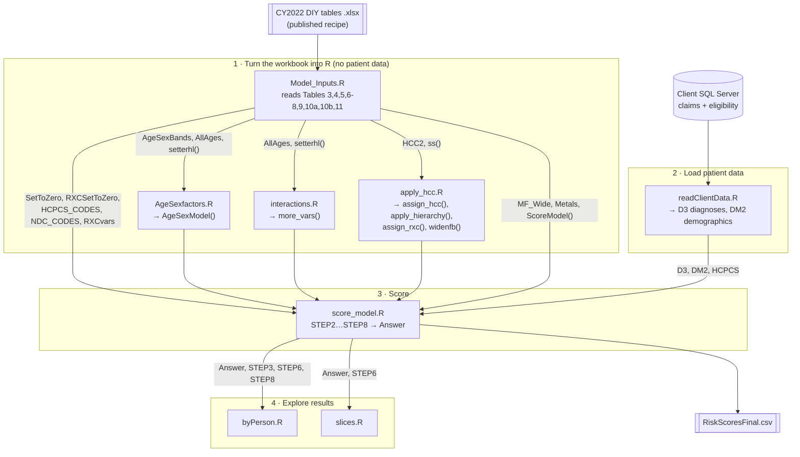
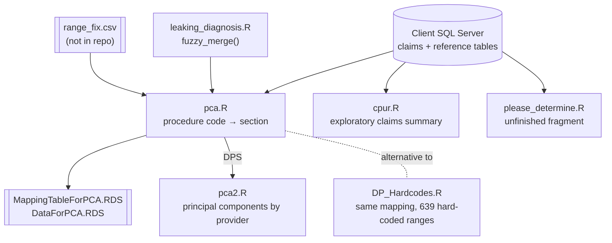

# HCCR: a health risk score engine in R

## What problem this solves

Health insurers and the organizations that share financial risk with them
need a fair way to compare groups of patients. A plan whose members are
mostly young and healthy will spend far less than a plan full of people with
diabetes, heart failure, or cancer, even if both plans are equally well run.
**Risk adjustment** corrects for that: every patient gets a number, a
*risk score*, that says how expensive their care is expected to be compared
with an average person. A score of 1.0 is average; 2.5 means roughly two and a
half times the expected cost. Payments between plans, or bonuses for
organizations that manage care well, are then adjusted by those scores.

The US federal government (the Department of Health and Human Services, HHS,
through its agency CMS) publishes the official recipe for one of these scores,
the **HHS-HCC model**. HCC stands for *Hierarchical Condition Category*: it
turns thousands of individual diagnosis codes into more than 100 condition groups
("Diabetes with chronic complications", "Heart failure", ...), each with a
price tag. The recipe is published every year as an Excel workbook, the
"DIY (Do It Yourself) tables". The official reference implementation is
written in SAS, a commercial statistics language.

**HCCR re-implements that recipe in R.** Rather than hand-typing hundreds of
rules and coefficients each year, it reads the published workbook and
*generates* the R code that applies the rules. When a new year's workbook
comes out, the idea is to point HCCR at the new file instead of rewriting
the program.

## How a risk score is built (the recipe in plain terms)

For each patient, over one year of insurance claims:

1. **Who are they?** Age and sex put the patient into a demographic band
   (for example "female, 45 to 49"). Adults, children, and infants are scored
   by separate models.
2. **How long were they covered?** Adults covered for only part of the year get
   an enrollment-duration adjustment (`ED_1` ... `ED_11`).
3. **What conditions do they have?** Every diagnosis code on their claims
   (ICD-10 codes, such as `E11.9` for type 2 diabetes) is mapped to a condition
   category (HCC). Some mappings only apply at certain ages or to one sex.
4. **Keep only the most serious version.** Categories form hierarchies: if a
   patient has "metastatic cancer" they are not also scored for "breast
   cancer". The lesser category is set to zero.
5. **Add combination flags.** Extra variables capture things like "severely
   ill and has this condition" or "has N payment conditions", written in the
   workbook as small `if ... then ...` rules in SAS syntax.
6. **Add up the price tags.** Each variable that is switched on has a
   coefficient. The coefficients differ by plan generosity, named by metal
   tier (Platinum, Gold, Silver, Bronze, Catastrophic). The sum is the
   patient's risk score for that tier.

## What's in the input workbook

`CY2022 DIY tables 06.30.2022.xlsx` (the 2022 benefit year) has these tabs.
HCCR currently reads the ones marked **used**.

| Tab | Contents | Used? |
|---|---|---|
| Table 1 | Which model (Adult, Child, Infant) applies at which age | no (hard-coded) |
| Table 2 | Procedure codes that make a claim eligible | no |
| Table 3 | Diagnosis code → condition category crosswalk, with age/sex conditions | **used** |
| Table 4 | Hierarchies: which categories to zero out when a more serious one is present | **used** |
| Table 5 | Age/sex band definitions | **used** |
| Tables 6, 7, 8 | Extra variables for Adult, Child, Infant models, written as SAS `if/then` rules | **used** |
| Table 9 | Coefficients for every variable, by metal tier | **used** |
| Table 10a / 10b | Prescription drug → drug category crosswalks (NDC and HCPCS codes) | **used** (10a needs pharmacy claims, see Known gaps) |
| Table 11 | Drug-category hierarchies | **used** |
| Table 12 | Conditions excluded from each model | no |

## How the code is organised

There are two groups of scripts. The **risk score pipeline** is the purpose of
the repo. The **procedure code clustering** scripts are a separate analysis
of doctors' billing patterns from the same client project and do not feed the
risk score.





### Run order for the risk score

The scripts share one R session and pass results through global variables,
so order matters. `Model_Inputs.R` begins with `rm(list=ls())`, which wipes
the session, so it must run first.

```r
source("Model_Inputs.R")    # read the workbook
source("AgeSexfactors.R")   # build AgeSexModel()
source("interactions.R")    # build more_vars()
source("apply_hcc.R")       # build assign_hcc(), apply_hierarchy(), assign_rxc(), widenfb()
source("readClientData.R")  # pull patients from SQL Server
source("score_model.R")     # compute scores → Answer
```

To try it without the database, `Rscript tests/run_synthetic.R` runs the same
steps on six made-up patients (`tests/synthetic_data.R`) chosen to exercise the
hierarchies, the age and sex filters, and the drug variables.

## File guide

### Risk score pipeline

| File | Reads | Produces | What it does |
|---|---|---|---|
| `Model_Inputs.R` | The DIY workbook (tabs 3, 4, 5, 6, 7, 8, 9, 10b) | `HCC2` (diagnosis → HCC), `SetToZero` (hierarchies), `AgeSexBands`, `AllAges` (if/then rules), `ModelFactors` / `MF_Wide` (coefficients), `Metals`, `HCPCS_CODES`; helper functions `ss()`, `setterhl()`, `ScoreModel()` | Loads every table the model needs and tidies it. `setterhl()` is the core trick: it takes a table of R statements stored as text and turns them into one callable R function. |
| `AgeSexfactors.R` | `AgeSexBands`, `AllAges`, `setterhl()` | `AgeSexModel()` | Turns each age/sex band (e.g. `FAGE_LAST_45_49`) into a rule like `pat_gender=='F' & pat_age>=45 & pat_age<=49`, adds the enrollment-duration rule, and compiles them into `AgeSexModel()`. Also builds SQL `CASE WHEN` text (`sql1`, `sql2`) that is not used yet. |
| `interactions.R` | `AllAges`, `setterhl()` | `more_vars()` | Translates the SAS `if … then do; …; end;` rules from Tables 6 to 8 into R `data.table` assignments and compiles one function per model (Adult, Child, Infant); `more_vars()` applies each patient's own model. This is the "SAS to R compiler". |
| `apply_hcc.R` | `HCC2`, `ss()` | `assign_hcc()`, `apply_hierarchy()`, `assign_rxc()`, `widenfb()`, `HCCvars` | `assign_hcc()` joins a patient's diagnoses to condition categories and drops those that fail the age or sex conditions and splits. `apply_hierarchy()` drops the milder categories (Tables 4 and 11). `assign_rxc()` maps drug codes to drug categories. `widenfb()` pivots to one row per patient with one 0/1 column per category, guaranteeing every category column exists. |
| `readClientData.R` | SQL Server `ModelDevelopment` database: `eligibility`, `claims_20210601_to_20220531` | `D3` (patient × diagnosis), `DM2` (patient age, sex, months enrolled), `HCPCS` (patient × drug/procedure code) | Pulls one year of claims (June 2021 to May 2022) and enrollment for the client. |
| `score_model.R` | Everything above | `STEP2` … `STEP8`, `Answer`; writes `RiskScoresFinal.csv` | Runs the pipeline: age/sex bands → HCC assignment → hierarchies → drug categories → wide table → combination flags → long table → join coefficients → sum per patient per metal tier. `STEP7` shows each patient's score broken down by variable. |
| `byPerson.R` | `STEP3`, `STEP8`, `Answer`, `HCCvars` | A histogram and summary of Silver scores | Quick look at the distribution of results. |
| `slices.R` | `Answer`, `STEP6`, `ModelFactors`, `HCC_HELPER` | `slicer()`, `j()` | Pulls the patients in a score range and lists the conditions driving their scores. `HCC_HELPER` is not defined anywhere in the repo. |

### Older versions and scratch work (not part of the pipeline)

| File | Status |
|---|---|
| `readEnrollment.R` | Earlier copy of `readClientData.R`. Uses `PERIOD_END_DT` before defining it. |
| `ageSexRisk.R` | Earlier approach to age/sex scoring. Depends on `AMTS` and `TBL1`, which no longer exist. |
| `age_sex_testing.R` | Scratch copy of `AgeSexfactors.R`. Also defines `remove_subordinate_hcc()`, an early hierarchy attempt replaced by `apply_hierarchy()`. |
| `so_r_example.R` | Unrelated parallel-computing snippet (has syntax errors). |
| `tests/` | `synthetic_data.R` stands in for `readClientData.R` with six made-up patients; `run_synthetic.R` runs the pipeline on them. |
| `sample.dat` | A few lines copied from Tables 6 and 7, showing the SAS rule syntax. |
| `ClaimsAS.RData` | Saved R workspace (about 5 MB unpacked), presumably sample claims or age/sex data; no script loads it. |

### Procedure code clustering (separate analysis)

| File | Reads | Produces | What it does |
|---|---|---|---|
| `leaking_diagnosis.R` | Tables passed in | `leaking()`, `fuzzy_merge()` | Helpers. `fuzzy_merge()` matches a code to the range it falls in and is needed by `pca.R`. The last line runs a debug call on data that must already exist. |
| `pca.R` | SQL Server claims, `ReferenceData.proc_cd_section`, `ReferenceData.ICD`, `range_fix.csv` | `DPS` (claims with a procedure section), `PR`; writes `MappingTableForPCA.RDS`, `DataForPCA.RDS` | Groups each billed procedure code into a named section (for example "Hearing Aids") so providers can be compared by what they bill. |
| `DP_Hardcodes.R` | `DP` | `DP` with `section`, `proc_grp` | The same grouping as `pca.R`, written as 639 hard-coded range assignments. |
| `pca2.R` | `DPS` | Principal components and clustering of providers | Exploratory; references objects (`A`, `AA`, `lbl`) that are not defined. |
| `please_determine.R` | SQL Server, `missing_codes_fix.csv` | `L_PC`, `R1` | Unfinished fragment of the section mapping. |
| `cpur.R` | SQL Server claims and `ReferenceData.ICD` | Cost summaries by procedure and place of service | Exploratory analysis of primary care usage. |

## Known gaps

These are what a reader would trip over when running the pipeline today:

- **Tied to one client's database.** `readClientData.R` connects to a specific
  SQL Server address and table names, with the date range written into the
  code.
- **Pharmacy claims.** Drug categories come from HCPCS codes on medical
  claims. Table 10a (pharmacy NDC codes) is loaded as `NDC_CODES` and
  `assign_rxc(NDC_CODES)` will use it, but `readClientData.R` does not pull
  pharmacy claims yet.
- **One age for everything.** The workbook tests diagnosis conditions on age at
  diagnosis and age splits on age at year end; the client data has a single
  `pat_age`, which is used for both.
- **Cost-sharing adjustment.** The `CSR_ADJUSTED_SCORE_*` multipliers in
  Tables 6 to 8 are not applied, and `Answer` reports all five metal tiers
  rather than picking the patient's own plan.
- **Model year.** The workbook file name and year 2022 are fixed in
  `Model_Inputs.R`.

## Requirements

R with `tidyverse`, `data.table`, `readxl`, `lubridate`, `rlang`, `knitr`,
and, for the database scripts, `odbc`, `RODBC` and access to the client's SQL
Server.

## License

See `LICENSE`.
